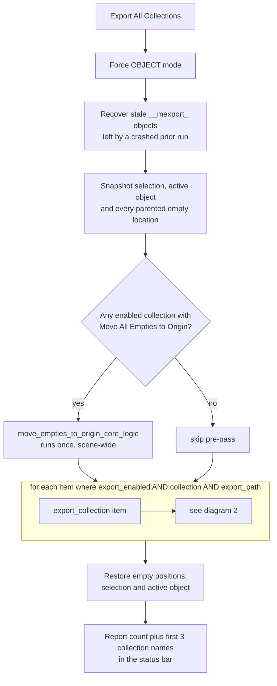
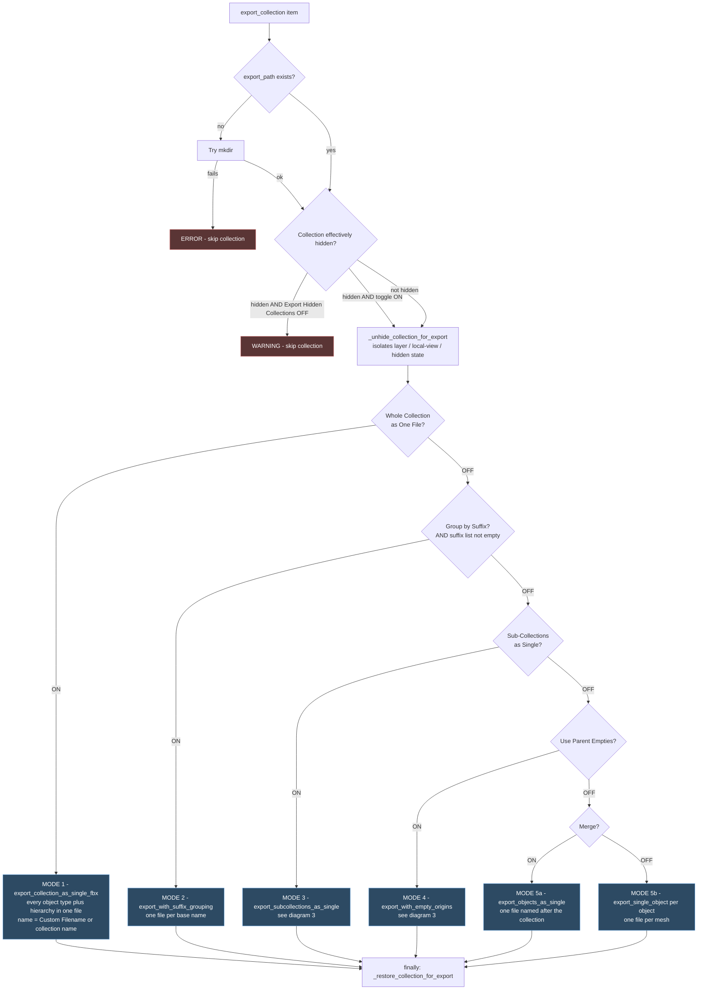
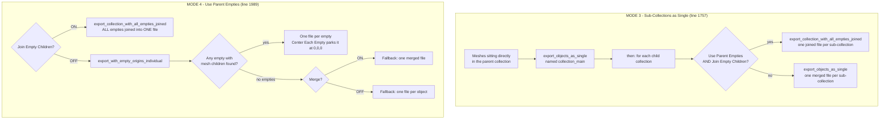
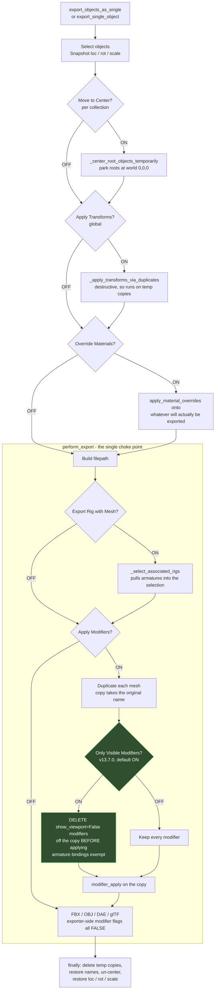
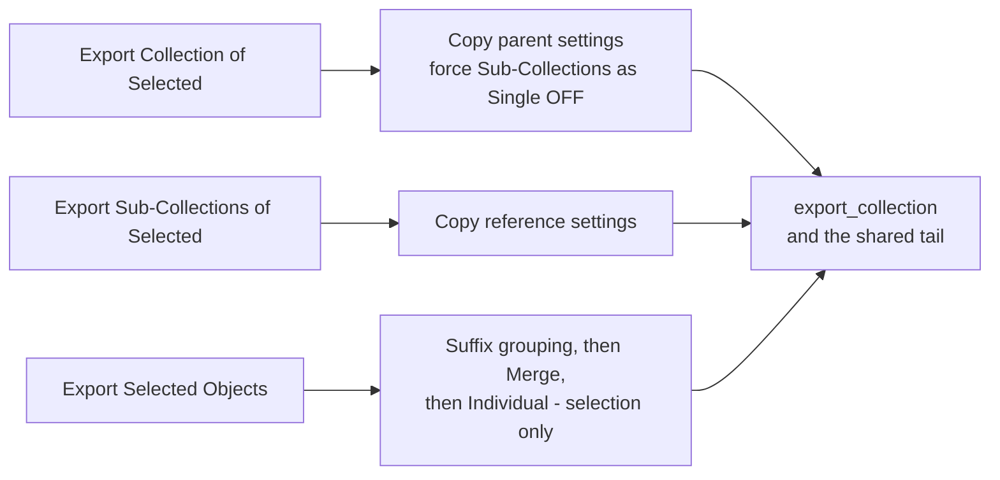

# Mass Collection Exporter — Export Flow

> Diagrams generated from `source/__init__.py` v13.7.0. Line references point at the
> dispatching code so this stays checkable against the source.

- [1. Top-level run](#1-top-level-run)
- [2. Per-collection gate and mode priority](#2-per-collection-gate-and-mode-priority)
- [3. Inside the empty-origins modes](#3-inside-the-empty-origins-modes)
- [4. The shared export tail](#4-the-shared-export-tail)
- [5. Settings reference](#5-settings-reference)

---

## 1. Top-level run

`MASSEXPORTER_OT_export_all.execute()` — `source/__init__.py:1277`

Everything below happens once per click, wrapped around the per-collection loop.

**Note:** the loop keys off each row's `export_enabled` checkbox, **not** the row highlighted
in the UIList. A per-item `try/except` means one failing collection does not abort the rest.

---

## 2. Per-collection gate and mode priority

`export_collection()` — `source/__init__.py:1688`

This is the diagram that matters. The five export modes are **mutually exclusive** and
resolved in a fixed priority order — turning two on does not combine them, the higher one
wins silently.

### Priority table

| # | Setting | Property | Result |
|---|---------|----------|--------|
| 1 | Whole Collection as One File | `export_as_single_fbx` | One file, all object types, hierarchy intact |
| 2 | Group by Suffix | `use_suffix_grouping` | One file per base name — `cube` + `cube_COL` becomes `cube.fbx` |
| 3 | Sub-Collections as Single | `export_subcollections_as_single` | One file per child collection, plus `<name>_main` |
| 4 | Use Parent Empties | `use_empty_origins` | Empties drive origins — joined or per-empty |
| 5 | Merge / *(none)* | `merge_to_single` | One merged file, or one file per object |

> **Mode 2 has a silent fallthrough.** `use_suffix_grouping` only fires when the global
> suffix list has at least one entry. With *Group by Suffix* ticked but no suffixes defined,
> the collection quietly drops to mode 3 / 4 / 5 instead.

---

## 3. Inside the empty-origins modes

Modes 3 and 4 both branch again on `join_empty_children`, and mode 3 can delegate into
mode 4's joining routine.

**Join path only:** when joining, `apply_modifiers_before_join` bakes modifiers onto the
temporary duplicates, and its sub-option `apply_only_visible` drops modifiers whose viewport
toggle is off. This is a *separate, older* setting from the global **Only Visible Modifiers**
in diagram 4 — it governs the join path only, and still defaults to OFF.

---

## 4. The shared export tail

Every mode above eventually funnels into `export_objects_as_single()` / `export_single_object()`
and then the single choke point `perform_export()` — `source/__init__.py:2920`.

### Why the modifier step looks like that

`bpy.ops.object.modifier_apply()` has **no notion of `show_viewport`** — it bakes a modifier
that is switched off in the stack exactly as if it were on. Measured on a cube with a visible
Subsurf and a disabled 3x Array:

| | Vertices |
|---|---|
| What the viewport shows | 26 |
| Vanilla "apply all modifiers" | **78** — the disabled Array got baked |
| *Only Visible Modifiers* ON | 26 |

The fix is to **delete** the disabled modifiers from the throwaway copy rather than skip them
in the apply loop. Deleting keeps stack order intact, so whatever follows a stripped modifier
evaluates on the previous result, exactly like the viewport. Source objects are never touched.

If *every* modifier on an object is hidden, no copy is made at all and the object exports as-is.

---

## 5. Settings reference

### Per-collection — one row in the collection list

| UI label | Property | Where it acts |
|---|---|---|
| Export | `export_enabled` | Diagram 1 — the loop filter |
| Export Path | `export_path` | Diagram 2 — created if missing |
| Whole Collection as One File | `export_as_single_fbx` | Mode 1 |
| Custom Filename | `single_fbx_custom_name` | Mode 1 filename |
| Group by Suffix | `use_suffix_grouping` | Mode 2 |
| Sub-Collections as Single | `export_subcollections_as_single` | Mode 3 |
| Use Parent Empties | `use_empty_origins` | Mode 4 |
| Center Each Empty | `center_parent_empties` | Mode 4, per-empty centering |
| Move All Empties to Origin | `move_empties_to_origin_on_export` | Diagram 1 — scene-wide pre-pass |
| Join Empty Children | `join_empty_children` | Modes 3 and 4 |
| Apply Modifiers | `apply_modifiers_before_join` | Join path only |
| Only Visible Modifiers | `apply_only_visible` | Join path only, default OFF |
| Merge | `merge_to_single` | Mode 5a, and mode 4's no-empties fallback |
| Move to Center | `move_to_center` | Diagram 4 — the shared tail |

### Global scene settings — apply to every collection

| UI label | Property | Where it acts |
|---|---|---|
| Export Format | `export_format` | Diagram 4 — which exporter runs |
| Export Hidden Collections | `export_hidden_collections` | Diagram 2 — the hidden gate |
| Apply Modifiers | `apply_modifiers` | Diagram 4 |
| Only Visible Modifiers | `apply_only_visible_modifiers` | Diagram 4, **default ON** (v13.7.0) |
| Skip Armature Modifier | `skip_armature_modifier` | Diagram 4 — suppresses ALL armature modifiers |
| Export Rig with Mesh | `export_rig_with_mesh` | Diagram 4 |
| Apply Transforms | `apply_transforms` | Diagram 4 |
| Override Materials | `override_materials` | Diagram 4 |
| Suffix list | `suffix_items` | Gates mode 2 |
| Debug Mode | `debug_mode` | Console output throughout |

---

## Quick-export entry points

The three quick-export buttons reuse the same machinery. They build a temporary collection
item, copy the reference collection's settings onto it, and drop into diagram 2:

