# Mass Collection Exporter — Tutorial

*Applies to v13.6.3 · Blender 4.2+ (tested on Blender 5.0) · Format: FBX / OBJ / Collada / glTF*

> **Confluence note:** attach the images from `MassExporter/assets/tutorial/` to the page, then the inline references below will resolve. All images are referenced by plain filename.

---

## 1. What the exporter is for (and how it thinks)

Exporting game/production assets from Blender by hand means repeating the same ritual for every asset: select the right objects, move them to the origin, apply modifiers, pick a path, type a filename, undo everything afterwards. Mass Collection Exporter turns that ritual into configuration:

- **Collections are the unit of export.** You register collections in a list once; each row remembers its own output folder and export behavior. From then on, one click (**Export All Collections**) re-exports everything — ideal for iterating on assets that must be re-delivered many times.
- **Every collection can behave differently.** One collection can export each mesh as its own file, another merges everything into one file, another groups collision/LOD meshes by name suffix. You mix modes freely in one batch.
- **The scene is never harmed.** Anything destructive (applying modifiers, applying transforms, joining, moving to origin, unhiding) happens on temporary duplicates or is snapshotted and restored in a `finally` block. After an export your scene is byte-for-byte the way you left it — selection, positions, and visibility included.
- **Hidden things export too.** Assets are usually hidden away in the outliner while you work. The exporter temporarily reveals hidden collections/objects (eye, monitor, exclude checkbox, local view…) so the batch always succeeds, then restores the visibility state exactly.

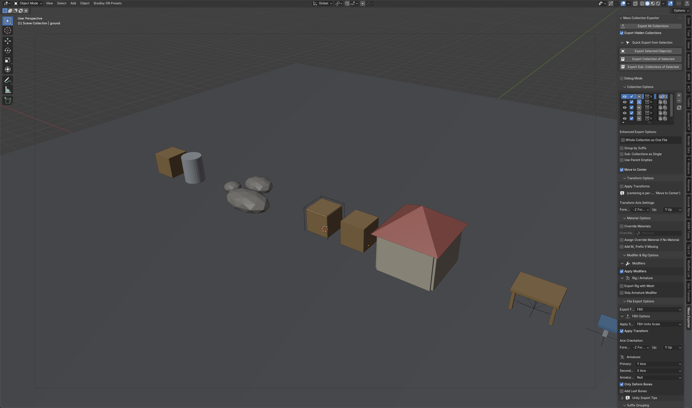

---

## 2. Where to find it

After installing the zip (`Edit → Preferences → Add-ons → Install from Disk…`), the panel lives in the **3D Viewport sidebar**: press **N** and pick the **Mass Exporter** tab.

The panel stack, top to bottom:

| Panel | Purpose |
|---|---|
| **Mass Collection Exporter** | The main export buttons + Quick Export from Selection |
| **Collection Options** | The export list — which collections, where to, and in which mode |
| **Transform Options** | Apply transforms, forward/up axis |
| **Material Options** | Material override on export |
| **Modifier & Rig Options** | Apply modifiers, armature handling |
| **File Export Options** | Format (FBX/OBJ/DAE/glTF) + FBX-specific settings |
| **Suffix Grouping** | Define the suffixes used by "Group by Suffix" |
| **Debug Controls** | Preview/diagnostic tools (collapsed by default) |

There is also an icon-only **Export All** button at the right end of the 3D viewport header — greyed out until at least one collection is enabled for export.

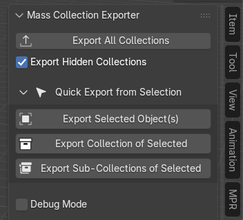

---

## 3. The demo scene used in this tutorial

Six collections, each configured differently so that a single **Export All** demonstrates every export mode:

```
Scene Collection
├── Props            crate, barrel                    → each object = own file
├── Rocks            rock_01..03                      → merged into one file
├── GameAssets       sm_crate_4x4, _COL, _LOD1        → suffix-grouped into one file
├── Building
│   ├── Building_Walls   wall_north/south/east/west  → each sub-collection = one file
│   └── Building_Roof    roof_main
├── Furniture        table_pivot ▸ top + 4 legs       → parent empties as origins
│                    stool_pivot ▸ seat + base
└── Vehicle          cart_root ▸ body + 4 wheels      → whole collection = one file
```

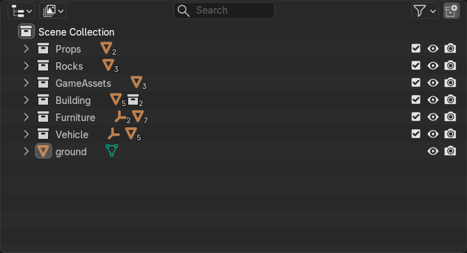

---

## 4. Core workflow

1. **Add rows** in *Collection Options* with the **+** button.
2. Per row: pick the **collection**, tick the **Export** checkbox, set the **export path** (folder icon).
3. Optionally set a per-row export mode (sections 5–9).
4. Click **Export All Collections**.

Anatomy of a list row, left to right:

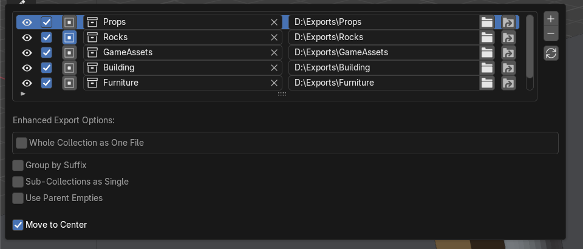

| Control | Meaning |
|---|---|
| 👁 Eye | Toggle the collection's viewport visibility (synced with the outliner eye) |
| ☑ First checkbox | **Export enabled** — only ticked rows are included in *Export All* |
| ▣ Second checkbox | **Merge to Single** — all meshes of the collection go into one file |
| Collection field | Which collection this row exports |
| ✕ | Clear the collection assignment |
| Path field + 📁 | Output folder for this row (folder icon opens a browser) |
| 🔄 (right side) | Refresh the list's visibility sync |

Two things worth internalizing:

- *Export All* cares **only about the Export checkbox** — not which row is highlighted. Highlighting a row merely shows its options in *Enhanced Export Options* below the list.
- A row without a path or collection is silently skipped, and each row exports in its own try/except — one broken collection never aborts the rest of the batch.

---

## 5. Export mode 1 — Individual objects (default)

With no extra options, every **mesh object** in the collection (including sub-collections) is exported as its own file, named after the object.

Demo: `Props` (crate + barrel), no options set →

```
D:\Exports\Props\crate.fbx
D:\Exports\Props\barrel.fbx
```

Use for: prop libraries where every object is a standalone asset.

---

## 6. Export mode 2 — Merge to Single

Tick the **Merge checkbox in the list row** (the small icon-button next to the export checkbox). All meshes of the collection are exported together into **one file named after the collection** — as separate meshes, not joined.

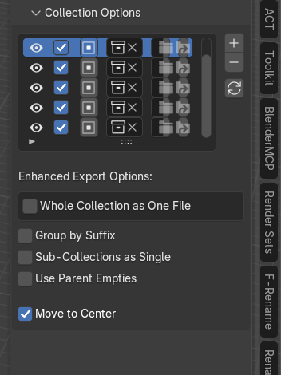

Demo: `Rocks` with Merge on →

```
D:\Exports\Rocks\Rocks.fbx        (contains rock_01, rock_02, rock_03)
```

Use for: scatter/kit sets that always travel together.

---

## 7. Export mode 3 — Group by Suffix *(new checkbox in v13.6.3)*

Game engines usually want the render mesh, collision mesh and LODs **in the same file**: `sm_crate_4x4.fbx` containing `sm_crate_4x4`, `sm_crate_4x4_COL`, `sm_crate_4x4_LOD1`. That's exactly what this mode does.

**Setup, part A — define the suffixes** (once per scene) in the **Suffix Grouping** panel. Click **Add Default Suffixes** to get the standard set: `_COL`, `_col`, `_UCX`, `_LOD0`–`_LOD3`. You can add your own with **+**, disable individual ones with the checkbox, and each carries a description.

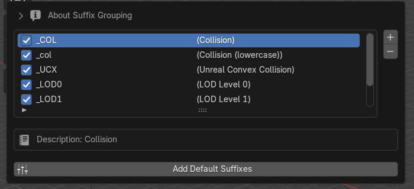

**Setup, part B — enable per collection:** highlight the row and tick **Group by Suffix** in *Enhanced Export Options*.

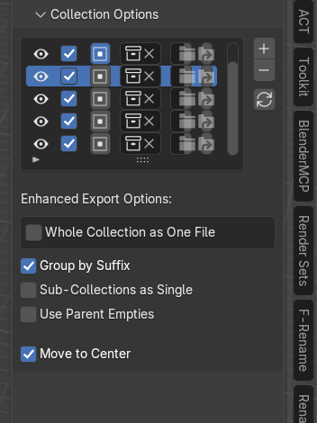

**Matching rules:**

- Matching is **case-insensitive** and anchored to the **end of the name**; the longest enabled suffix wins.
- One trailing separator (`_`, `-`, `.`, space) before the suffix is stripped too.
- Grouping also understands structure: a **parent empty**'s name is suffix-matched and its mesh children join that group; likewise a **sub-collection**'s name groups all meshes inside it.
- Objects that match no suffix simply group under their own full name (and export alone).

Demo: `GameAssets` (3 objects) →

```
D:\Exports\GameAssets\sm_crate_4x4.fbx     (3 separate meshes in one file)
```

---

## 8. Export mode 4 — Sub-Collections as Single

Tick **Sub-Collections as Single** to export **each direct sub-collection as one merged file**, named after the sub-collection. Meshes sitting directly in the parent collection (not in any sub-collection) are collected into `<collection>_main.<ext>`.

Demo: `Building` (walls + roof sub-collections) →

```
D:\Exports\Building\Building_Walls.fbx     (4 wall meshes)
D:\Exports\Building\Building_Roof.fbx
```

Use for: modular sets organized as `Env_Buildings > Building_01, Building_02, …` where each sub-collection is one deliverable.

---

## 9. Export mode 5 — Use Parent Empties

For assets rigged around **empties as pivot points** (furniture, machinery parts). The empty acts as the export origin for its mesh children.

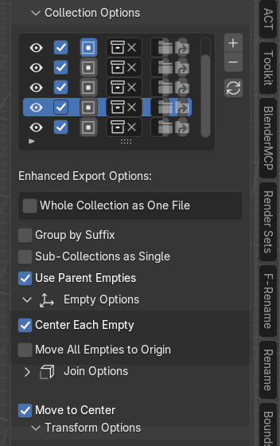

Enabling it reveals two sub-panels:

**Empty Options**
- **Center Each Empty** (default on) — each empty is temporarily moved to the world origin while its children export, so the empty's position becomes the pivot. Restored afterwards.
- **Move All Empties to Origin** — moves every empty to origin *before the batch starts* (also restored at the end).

**Join Options**
- **Join Empty Children** — instead of exporting children individually, duplicates of all empties' children are joined into **one object named after the collection** and exported as a single file. The join happens on duplicates; your originals are untouched.
- **Apply Modifiers** (sub-option) — apply modifiers on the duplicates before joining; **Only Visible Modifiers** skips viewport-disabled ones.

Naming without joining: one child → `<empty>.fbx`; several children → `<empty>_<child>.fbx`.

Demo: `Furniture` (table_pivot + stool_pivot, no join) →

```
D:\Exports\Furniture\table_pivot_table_top.fbx
D:\Exports\Furniture\table_pivot_table_leg_1.fbx … table_leg_4.fbx
D:\Exports\Furniture\stool_pivot_stool_seat.fbx
D:\Exports\Furniture\stool_pivot_stool_base.fbx
```

> If the collection contains no empties with mesh children, this mode silently falls back to a normal export (merged or individual).

---

## 10. Export mode 6 — Whole Collection as One File

The nuclear option: **everything** in the collection and all its descendants — meshes, armatures, empties, curves, lights, cameras — into a **single file with hierarchy preserved**. Because rigs ship in the same file, armature modifiers stay bound (no baked-down skinning).

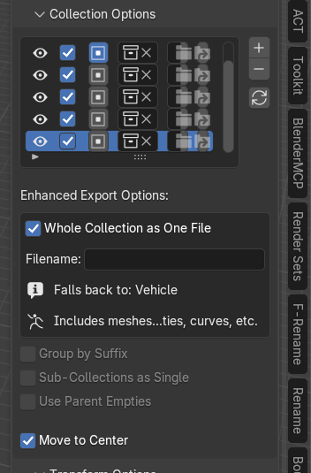

- Optional **Filename** field — leave empty to use the collection name (the panel shows what it falls back to).
- When enabled, the other mode checkboxes grey out — this mode takes priority over everything.

Demo: `Vehicle` (empty root + body + 4 wheels) →

```
D:\Exports\Vehicle\Vehicle.fbx    (full hierarchy: cart_root ▸ cart_body, cart_wheel_1–4)
```

Use for: vehicles, characters with rigs, any asset where internal hierarchy matters.

---

## 11. Mode priority — what wins when several are ticked

First match wins, per collection:

1. **Whole Collection as One File**
2. **Group by Suffix**
3. **Sub-Collections as Single**
4. **Use Parent Empties**
5. Otherwise: **Merge to Single** if ticked, else **individual objects**

**Move to Center** is not a mode — it composes with all of the above (see §13).

---

## 12. Quick Export from Selection

The three buttons in the main panel export based on what's selected in the viewport, using the settings of the collection's row in the list (or a parent collection's row as fallback). Great for re-exporting one asset without running the whole batch.

| Button | What it exports |
|---|---|
| **Export Selected Object(s)** | Only the selected objects. One object → `<object>.fbx`; several objects from the same collection → `<collection>_selected.fbx`. If the parent row has *Sub-Collections as Single* on, the object's whole sub-collection is exported instead. |
| **Export Collection of Selected** | The entire immediate collection containing the active object, as one export (sub-collection splitting is temporarily off). |
| **Export Sub-Collections of Selected** | Each direct sub-collection of the selected object's collection, individually. |

Requirements: the object's collection (or one of its parents) must be in the export list **with an export path** — otherwise the button warns and does nothing.

---

## 13. Move to Center

Per-collection toggle (default **on**): during export, every **root object** of the export set is temporarily parked at the world origin `(0,0,0)`, then restored. Your asset lands in the engine centered at its pivot instead of wherever it happened to sit in the scene.

⚠️ **Gotcha:** each root goes to the origin *individually* — it is not a group centroid. If one export contains several independent roots, they will stack on top of each other at origin and lose their relative layout. Keep it on for single-pivot assets; turn it off when exporting arrangements whose spatial relationship matters.

---

## 14. Global settings (apply to every collection)

### Transform Options
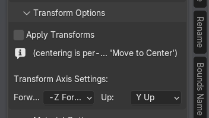

- **Apply Transforms** — bake location/rotation/scale into the geometry before export. Runs on temporary duplicates; your originals keep their transforms.
- **Forward / Up axis** — coordinate convention for the target application (default `-Z` forward, `Y` up — the Unity-friendly convention).

### Material Options
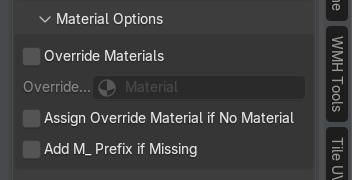

- **Override Materials** + material picker — replace all materials on export (e.g., export everything with a placeholder).
- **Assign Override Material if No Material** — also covers objects with no material at all.
- **Add M_ Prefix if Missing** — enforce the `M_` material naming convention in the exported file.

### Modifier & Rig Options
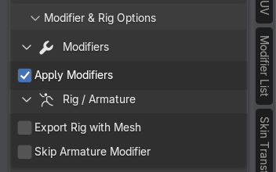

- **Apply Modifiers** (default on) — modifiers are applied on temporary duplicates; the originals keep their live stacks. Armature modifiers whose rig is part of the same export are *not* baked (that would destroy the skinning).
- **Skip Armature Modifier** — force-skip armature deformation (export the undeformed mesh).
- **Export Rig with Mesh** — pull the armature object into the export even if it lives outside the exported collection.

### File Export Options
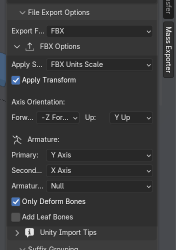

- **Export Format** — FBX (default), OBJ, Collada (DAE), glTF 2.0.
- FBX-only extras: **Apply Scaling** (default *FBX Units Scale*, recommended for Unity), **Apply Transform** (bake space transform — avoids the notorious ×100/rotation issues in Unity), bone axis settings, **Only Deform Bones**, **Add Leaf Bones**, and a collapsible *Unity Import Tips* note.
- ⚠️ Axis/scale/armature settings apply to FBX (and partially OBJ). The glTF exporter is called with selection only and uses its own conventions.

### Export Hidden Collections
Main panel, directly under the export button (default **on**): hidden collections and objects — outliner eye, monitor icon, exclude checkbox, per-object hide, selection lock, even local view — are temporarily revealed for the export and then restored exactly. Turn it **off** to have hidden collections skipped with a warning instead.

---

## 15. Debug tools

**Debug Mode** (main panel) prints a detailed per-step log to the system console (`Window → Toggle System Console`) — the first thing to enable when an export doesn't do what you expect.

The **Debug Controls** panel offers two *permanent* (but undoable, Ctrl+Z) scene operations that let you preview what the empty-based modes will do:

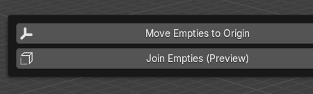

- **Move Empties to Origin** — actually moves all empties (of enabled collections) to origin, so you can inspect the export positioning. Unlike export-time centering, this is a real scene edit.
- **Join Empties (Preview)** — creates and *keeps* joined duplicate copies (`<collection>_joined`) so you can inspect exactly what a joined export would contain.

---

## 16. What a full batch looks like

One click on **Export All Collections** with the demo configuration produces:

```
D:\Exports\
├── Props\crate.fbx, barrel.fbx                  ← individual
├── Rocks\Rocks.fbx                              ← merged
├── GameAssets\sm_crate_4x4.fbx                  ← suffix-grouped (mesh + _COL + _LOD1)
├── Building\Building_Walls.fbx, Building_Roof.fbx  ← per sub-collection
├── Furniture\table_pivot_*.fbx, stool_pivot_*.fbx  ← per empty child
└── Vehicle\Vehicle.fbx                          ← whole hierarchy, one file
```

The status bar reports `Exported 6 collections: Props, Rocks, GameAssets, … (6 total)` and the scene is left exactly as it was.

---

## 17. Tips, gotchas & troubleshooting

- **Nothing exports?** Check the three per-row requirements: Export checkbox ticked, collection assigned, path set. Then enable Debug Mode and watch the console.
- **Highlighted ≠ enabled.** The active (highlighted) row only controls which options are shown below the list. Only the Export *checkbox* includes a row in the batch.
- **Crash recovery is automatic.** Temporary duplicates are named `__mexport_<name>`; if Blender crashed mid-export, the next *Export All* detects leftovers and restores the original names.
- **Objects pile up at origin in the export?** That's *Move to Center* with multiple independent roots — see §13.
- **Wrong scale/rotation in Unity?** Keep *Apply Scaling = FBX Units Scale* and *Apply Transform* on (both defaults).
- **Suffix didn't group?** The suffix must be enabled in the Suffix Grouping list, and *Group by Suffix* must be ticked on that collection's row. Matching is end-of-name; `sm_crate_COL_old` will not match `_COL`.
- **glTF looks different from FBX** — expected; the glTF path passes only the selection, none of the FBX-specific transforms.
- **Non-mesh objects missing?** Curves/lights/armatures are only included by *Whole Collection as One File*; the other modes export meshes.

---

*Tool by Stephan Viranyi (Stephko) · Tutorial generated 2026-07-13 for v13.6.3 · Images: `assets/tutorial/`*
