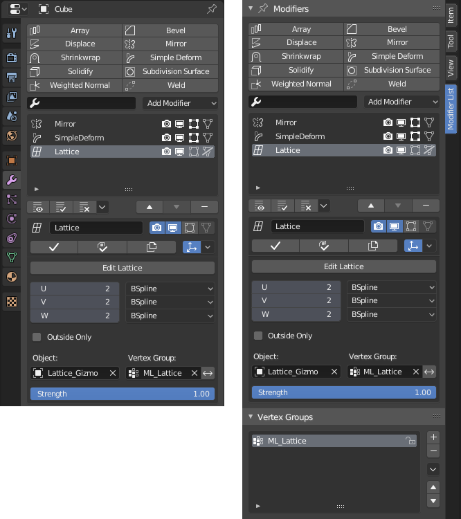
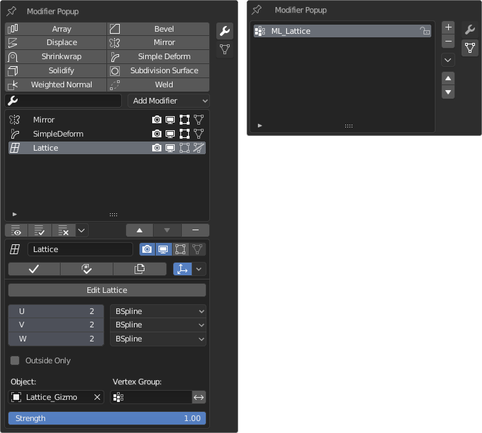

# Modifier List (Stephko fork)

**Version:** 1.9.89 · **Blender:** 4.2+ · **Category:** Interface · **Author:** Stephan Viranyi (fork)

A fork of the *Modifier List* addon with Stephko-specific fixes — notably restoring the
**Geometry Nodes Input Attribute Toggle** in the list view on Blender 5.

Full feature list: the upstream [Modifier List docs](source/docs/README.md).

## Install
Drag-and-drop [`distribution/ModifierList_Stephko_v1.9.89.zip`](distribution/ModifierList_Stephko_v1.9.89.zip)
onto Blender (4.2+), or install it via *Edit ▸ Preferences ▸ Add-ons ▸ Install from Disk*.

---

[Developer notes](source/DEVELOPMENT.md)
