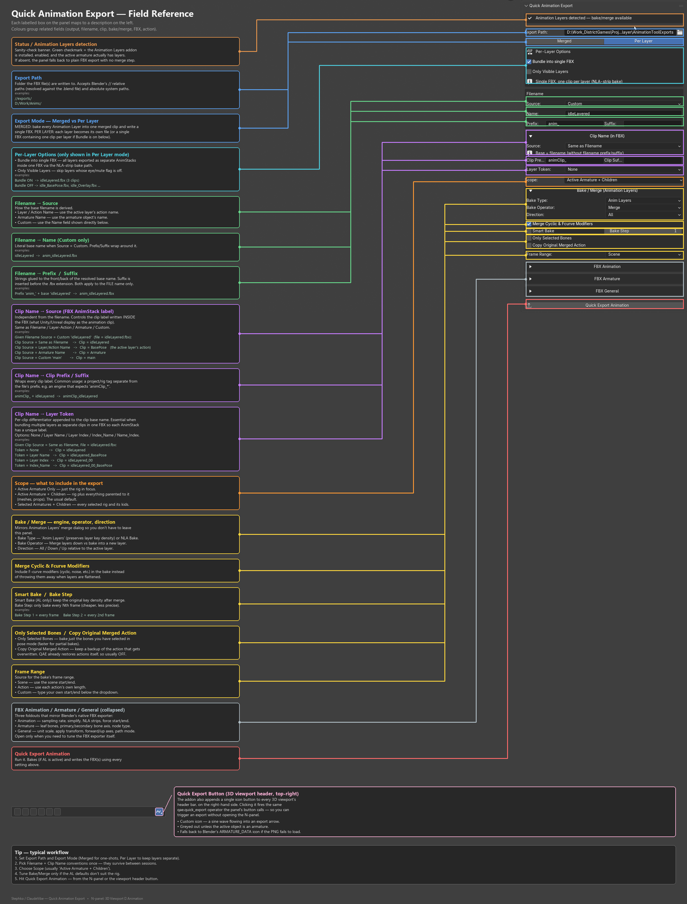

# Quick Animation Export

**Version:** 1.0.9 · **Blender:** 4.2+ · **Category:** Animation · **Author:** Stephan Viranyi

Streamlined export of animation/action clips from Blender to game-engine-ready files.

## Install
Drag-and-drop the latest zip from [`distribution/`](distribution/) onto Blender
(4.2+), or install it via *Edit ▸ Preferences ▸ Add-ons ▸ Install from Disk*.

---

[Developer notes](source/DEVELOPMENT.md)
