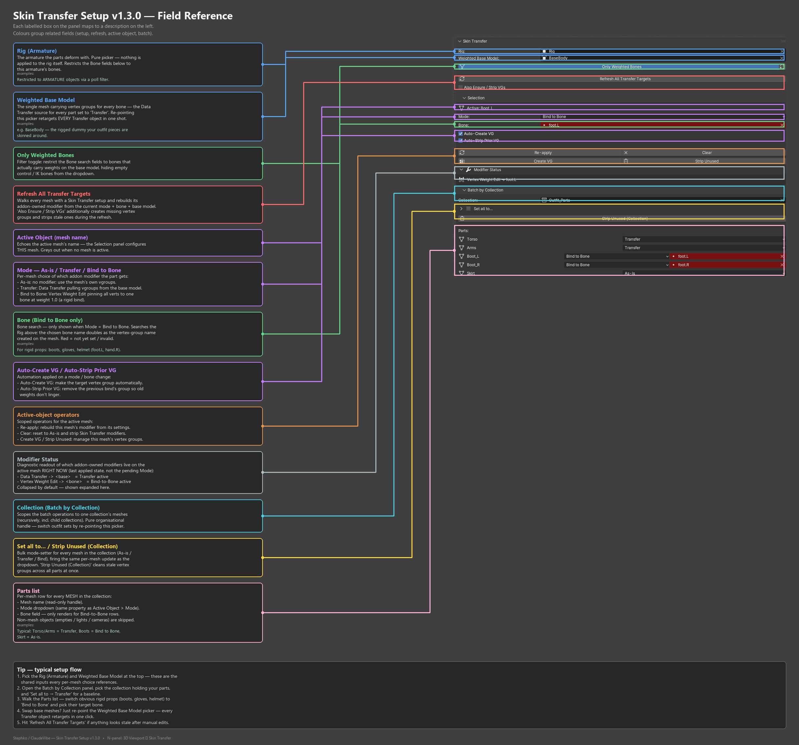

# Skin Transfer Setup

**Version:** 1.3.0 · **Blender:** 4.2+ · **Category:** Rigging · **Author:** Stephan Viranyi

Per-part skin setup helper. Tag each mesh in a collection as **As-is**, **Data Transfer**
(from a weighted base model), or **Bind-to-bone** (via Vertex Weight Edit). The rig and
base model are stored centrally, so swapping the base retargets every transfer in one click.

## Install
Drag-and-drop the latest zip from [`distribution/`](distribution/) onto Blender
(4.2+), or install it via *Edit ▸ Preferences ▸ Add-ons ▸ Install from Disk*.

---

[Developer notes](source/DEVELOPMENT.md)
