# ST3E Geometry Nodes Library

> Procedural Geometry Nodes assets for Blender 5.0+ — a library of **53 ST3E modifiers**
> plus supporting node groups, all available from the **Add Modifier → ST3E** quick-pick menu.

**Location:** `Blender/Geonodes/`
**Author:** Stephan Viranyi (Stephko)
**Target:** Blender 5.0+ (most also work on 4.5)

---

## 📥 Installation

These node groups are shipped as **Asset-Browser assets**, tagged `ST3E` and catalogued so
they appear directly in the modifier menu.

1. **Preferences → File Paths → Asset Libraries** → add a library pointing at the
   `Blender/` folder (the asset catalog `blender_assets.cats.txt` lives there).
2. Set the import method to **Link** (or Append, if you want a local copy).
3. In any object's modifier stack: **Add Modifier → ST3E** → pick a modifier.
   - The `ST3E` tag also lets you filter/group them in the Asset Browser.

Each `.blend` ships a **demo object** with the modifier already attached, so you can open the
file directly to inspect a working setup.

> **Note:** `GN_FillBorder`, `GN_MeshFromImage`, `GN_DisplaceByImage` and the tree-generator
> files are not in the modifier menu — drag them in from the Asset Browser instead.
---

## 🧱 Modifier Reference

### Deformers
Move existing vertices. Pivot-based deformers expose an editable **Center** + **Show Center
Gizmo** (3-axis arrow gizmo, overlay only) and a **Show Deformation Preview** cage toggle.

**Effect direction — quick axis _or_ an empty.** Every deformer with a direction/axis lets you
pick it fast (X / Y / Z) **or** choose **`Object`** on the same menu and point a **Direction
Object** (an empty) — the effect then follows the empty's local **+Z** axis, so you aim it just by
rotating the empty. Center-based deformers also add **Use Object As Center** (default off) to make
the empty's location the pivot. The manual X/Y/Z + Center controls stay fully first-class.

| Icon | Modifier | File | What it does | Key parameters |
|:---:|----------|------|--------------|----------------|
| 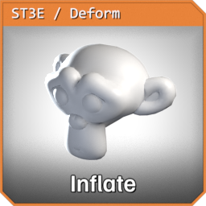 | **GN_Inflate** | `GN_Inflate.blend` | Push geometry along its normals | Amount, Selection |
| 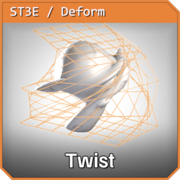 | **GN_Twist** | `GN_Twist.blend` | Twist around an axis | Axis (X/Y/Z/**Object**), Angle, Symmetry, Center, Direction Object, Use Object As Center |
| 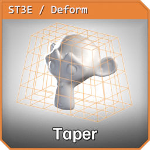 | **GN_Taper** | `GN_Taper.blend` | Scale cross-section along an axis | Axis (X/Y/Z/**Object**), Factor, Symmetry, Affect X/Y/Z, Center, Direction Object, Use Object As Center |
| 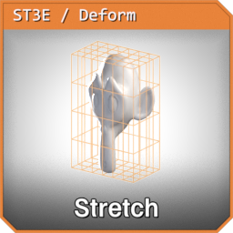 | **GN_Stretch** | `GN_Stretch.blend` | Volume-preserving squash & stretch | Axis (X/Y/Z/**Object**), Factor, Affect X/Y/Z, Center, Direction Object, Use Object As Center |
| 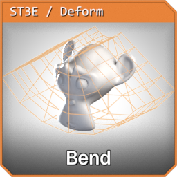 | **GN_Bend** | `GN_Bend.blend` | Bend a bar into an arc, in any direction | **Bend Axis** (length, X/Y/Z/Object), **Bend Direction** (deflection, X/Y/Z/Object), Angle, Center, Direction Object, Use Object As Center |
| 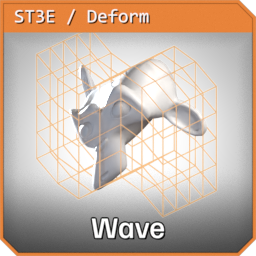 | **GN_Wave** | `GN_Wave.blend` | Continuous sine displacement that keeps cycling across the whole object; **Symmetry** restores the mirrored concentric ripple, **Ripple Axes** sets the travel direction/weights (zero an axis -> planar wave), **Affect Axes** weights the offset | Amplitude, Wavelength, Phase, Displace Along (X/Y/Z/Normal/**Object**), **Symmetry**, **Ripple X/Y/Z**, **Affect X/Y/Z**, Center, Direction Object, Use Object As Center |
| 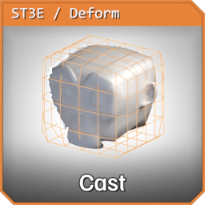 | **GN_Cast** | `GN_Cast.blend` | Cast toward a sphere / cylinder / box | Shape, Factor, Radius, Axis (X/Y/Z/**Object**), Center, Direction Object, Use Object As Center |
| 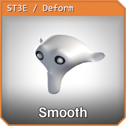 | **GN_Smooth** | `GN_Smooth.blend` | Relax positions (blur) | Iterations, Factor, Selection |
| 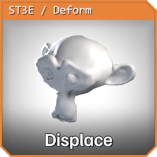 | **GN_Displace** | `GN_Displace.blend` | Coherent noise displacement | Strength, Midlevel, Scale, Detail, Direction (Normal/X/Y/Z/**Object**), Direction Object |
| 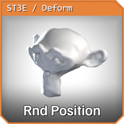 | **GN_RandomizePosition** | `GN_RandomizePosition.blend` | Per-element jitter via noise | Direction, Noise Type, Amount, Scale, Detail, Roughness, Seed |
| 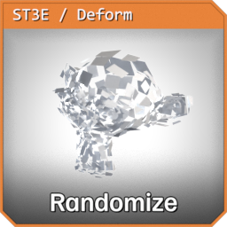 | **GN_RandomizeMeshElements** | `GN_RandomizeMeshElements.blend` | Give every mesh element (island / face / material / attribute group) its own random offset, rotation, scale and axis mirroring | Group By, Group Attribute, Seed, Affect Chance, Position Amount, Rotation Amount, Uniform Scale, Scale Min/Max, Flip X/Y/Z Chance, Flip Faces On Mirror, Pivot Point |
| 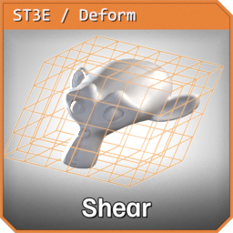 | **GN_ShearGeometry** | `GN_ShearGeometry.blend` | Shear along an axis with a mask axis | Shear Factor, Shear Axis (X/Y/Z/**Object**), Mask Axis (X/Y/Z/**Object**), Symmetry, Center, Direction Object |
| 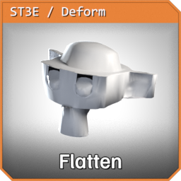 | **GN_FlattenByBoundary** | `GN_FlattenByBoundary.blend` | Flatten each face region (walled off by a boundary edge selection) to its own average plane | Boundary Edges, Factor, Selection |
| 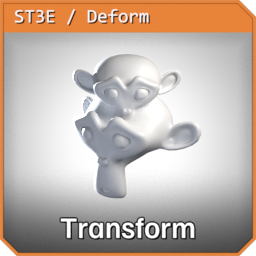 | **GN_SimpleTransformMesh** | `GN_SimpleTransform.blend` | Transform selected geometry (world or local) | Translation, Rotation, Scale, World Space |
| 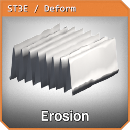 | **GN_Erosion** | `GN_Erosion.blend` | Erosion-style carving along an axis, faded by a normal-based mask | Along Axis (X/Y/Z/**Object**), Scale, Erosion Strength, Distortion, Detail Scale, Phase Offset, Exponent, Masking Axis / Exponent / Multiply, Direction Object, Selection |
| 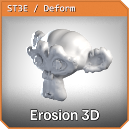 | **GN_Erosion_3D** | `GN_Erosion_3D.blend` | 3D variant of GN_Erosion: Voronoi-band erosion with curvature-based damage and a noise mask | Scale Min/Max, Erosion Strength, Detail Scale, Phase Offset, Band Distortion, Rotation, Curvature Damage Min, Iterations, Noise Mask (Vector / Scale / Distortion), Tile Scale, Erosion Direction Variation, Masking Axis / Exponent / Multiply, Selection |
| 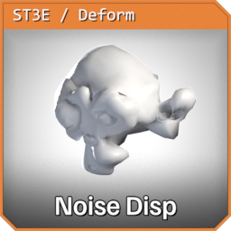 | **GN_NoiseDisplace** | `GN_NoiseDisplace.blend` | Tileable noise displacement (links `SHG_TileableNoise.blend`) | Tileable, Tile Scale, Noise Scale / Offset, Detail, Roughness, Lacunarity, Gain, Distortion, Overall Strength, Displace Offset, Displace Along (Custom Vector / Normal / **Object**), From/To Min/Max remap, Direction Object, Selection |
| 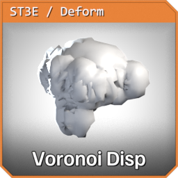 | **GN_VoronoiDisplace** | `GN_VoronoiDisplace.blend` | Voronoi sibling of GN_NoiseDisplace | Same as GN_NoiseDisplace, plus Blocking |

### Generators & Topology
Create, replace, or restructure geometry.

| Icon | Modifier | File | What it does | Key parameters |
|:---:|----------|------|--------------|----------------|
| 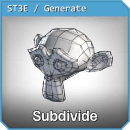 | **GN_Subdivide** | `GN_Subdivide.blend` | Subdivide (Catmull-Clark or simple) | Level, Smooth |
| 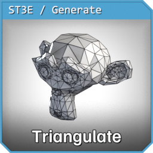 | **GN_Triangulate** | `GN_Triangulate.blend` | Triangulate faces | Selection |
| 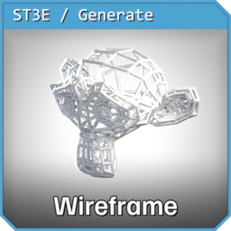 | **GN_Wireframe** | `GN_Wireframe.blend` | Convert edges to a wireframe mesh | Selection (which edges), Thickness, Resolution, Fill Caps |
| 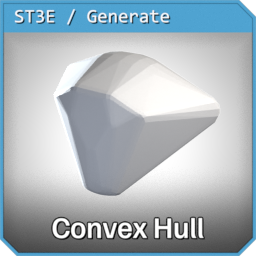 | **GN_ConvexHull** | `GN_ConvexHull.blend` | Convex hull of the input, or of the selected part | Geometry, Selection |
| 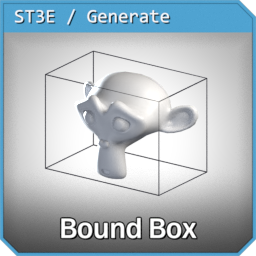 | **GN_BoundingBox** | `GN_BoundingBox.blend` | Axis-aligned bounding-box mesh of the input, or of the selected part | Geometry, Selection |
| 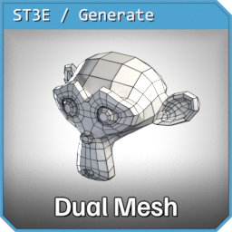 | **GN_DualMesh** | `GN_DualMesh.blend` | Dual mesh (faces ↔ vertices) | Keep Boundaries |
| 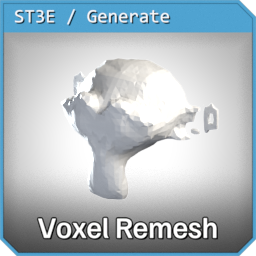 | **GN_VoxelRemesh** | `GN_VoxelRemesh.blend` | Volume-based voxel remesh | Voxel Size, Adaptivity |
| 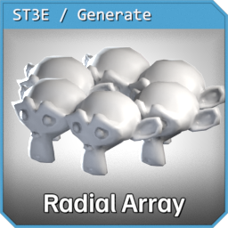 | **GN_RadialArray** | `GN_RadialArray.blend` | Radial duplicate around a center (realized) | Count, Radius, Axis, Center |
| 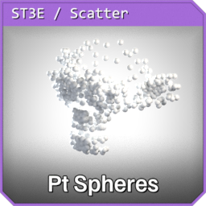 | **GN_PointsToSpheres** | `GN_PointsToSpheres.blend` | Replace vertices with ico-sphere instances | Radius, Subdivisions, Selection |
| 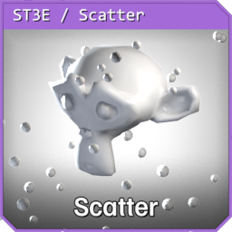 | **GN_Scatter** | `GN_Scatter.blend` | Scatter an object over the surface | Instance Object, Density, Seed, Scale Min/Max, Align to Normal |
| 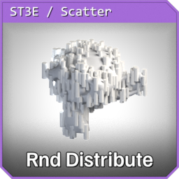 | **GN_RandomDistribute** | `GN_RandomDistribute.blend` | Poisson-disk scatter of a spawn object over the mesh, a surface object or a generated grid, with its own seed per channel and optional ID / noise / surface attributes. Needs a **Spawn Object**, and **Use External Normal Object** off unless a normal object is set, or it outputs nothing | Surface Type, Add / Keep Surface, Surface Object, Grid Size / Vertices X/Y, Spawn Object, Density (+ Multiplier), Distance Min/Max, Distribution / Uniform Scale / Scale / Rotation / Spawn Seed, scale and rotation ranges, Placement Noise (factor, scale, detail, affects IDs / scale / attribute), Write Surface / ID / Noise Attribute, Set Normal, Use External Normal Object, Normal Surface Object, Selection |
| 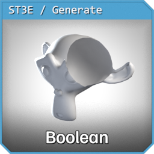 | **GN_MeshBoolean** | `GN_MeshBoolean.blend` | Boolean against a cutter object | Cutter Object, Operation, Self Intersection, Hole Tolerant |
| 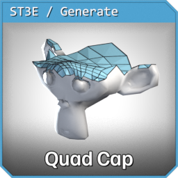 | **GN_QuadCap** | `GN_QuadCap.blend` | Closes open borders (holes) with an all-quad cap instead of an n-gon. Each closed border loop of N vertices gets an a × b quad grid (2a + 2b = N, so a 16-gon becomes 4 × 4) whose interior is placed by a Coons patch, so the grid follows the loop's shape. An odd loop gets exactly one triangle, in a grid corner. The cap's winding is read from the faces next to the hole, so normals come out consistent with the mesh. Closed loops of loose edges (e.g. a circle primitive) can be filled too. Cap faces are output as a `Cap` attribute. Caps get material index 0 and no UVs | Selection, Invert Selection, Corner Offset, Side Balance, Max Border Vertices, Cap Loose Edge Loops, Relax Iterations, Dome, Merge With Mesh, Merge Distance, Flip Cap Normals |
| 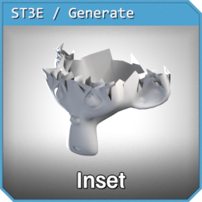 | **GN_InsetFaces** | `GN_InsetFace.blend` | Pulls open-border vertices inward by Offset. Despite the name it adds no faces — on a closed mesh it does nothing | Selection, Offset |
| 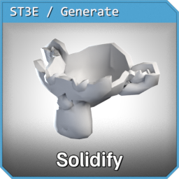 | **GN_Solidify2** | `GN_Solidify2.blend` | Solidify with crease and sharp-edge control per side: top, back and rim edges can take their crease / sharpness from the source edges, vertex creases or corner topology | Thickness, Offset, Edge Crease Top / Back (+ Mix), Rim Edge Crease from Vertex / Edge Crease, Sharp Edges Top / Back, Rim Sharp Edge from Vertex / Edge Crease, Corner Edge from Outer / Inner Corner Topo |
| 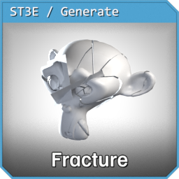 | **GN_CellFrac** | `GN_CellFrac.blend` | Fractures the mesh into cells by iterative cuts, as mesh or instances. Crater mode concentrates the cuts around an impact object; the pieces can then be scattered | Cut Iterations, Seed, Output Instances, Instances on Origin, Probability, Object, Impact Radius, Crater Mode, Crater Falloff, Min/Max Cut Iterations, Refine Passes, Cuts per Pass, Scatter Pieces, Push Pull, Lift, Random Position / Rotation / Scale (each with Center Bias), Scatter Seed |
| 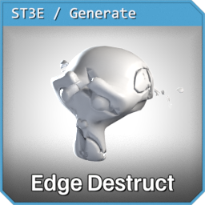 | **GN_EdgeDestruct** | `GN_EdgeDestruct_fixed.blend` | Chips edges and corners sharper than an auto angle with Voronoi/noise-shaped damage. Use the `_fixed` file — `GN_EdgeDestruct.blend` only holds a reference copy | Edge / Corner Auto Angle Degrees, Min/Max Damage, Corner Damage (+ Angle Variance / Randomness / Scale), Voronoi and Noise shape controls, Cuts, Damage Iterations Min/Max + seeds, Probability, Rotation, Merge Distance, Add Crease, Extra Tubes (count, spacing, radius, noise), Show Regular Tubes / Extra Tubes / Damage Cubes |
| 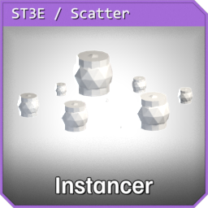 | **GN_CollectionInstancerModel** | `GN_CollectionInstancer.blend` | Advanced grid/collection instancing system | Instance Type, Collection/Object, Grid, Seed, Offset/Rotation/Scale, Material Override |
| 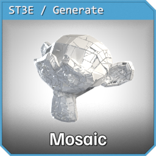 | **GN_Mosaic** | `GN_Mosaic.blend` | Fills the areas of a surface with mosaic tesserae. Two generators via **Tiling Mode**, each with its own parameter panel: *Grid* lays a rotated lattice and keeps the cells that fit; ***Shatter*** instead SUBDIVIDES each region itself, so the tiles **partition the shape exactly** — verified 100.00% coverage at zero grout, every outline, corner and hole formed by real tile edges, nothing clipped and no strip left over. **Max Corners** (3-6) picks the break-up: all-triangle, quads, or the loose polygonal paving of opus palladianum with pentagons and hexagons. Grout is exact per edge, so **Boundary Gap** can hold the tiles off the walls while their shared edges keep the ordinary Gap — and **Tileable** + **Tile Bounds** make a patch repeat seamlessly: edges on a bounds face take half the interior Gap, so two copies laid side by side meet with exactly one Gap, indistinguishable from any other joint, and cuts never add a vertex to a seam so the two faces stay divided identically at any Split Jitter (verified on a 3×3 array, 0 unmatched cuts). **Sizes and grout are ranges, not single numbers.** **Tile Size Max**, **Gap Max** and **Boundary Gap Max** each turn their base value into a `min .. max` band that every tessera or joint draws from — the quickest way to stop a mosaic reading as a manufactured sheet. All three are 0 by default, which means *no range* and byte-identical output to before. Grid mode spaces its lattice for the largest tile and lets the smaller draws sit in correspondingly more grout; Shatter splits each piece down to its own target, so the range changes the break-up itself. In Shatter the grout is drawn per **edge** from the edge's own midpoint, so both tiles sharing a joint agree on its width and it stays even along its length — and stays in register across a Tileable seam. Keep the maxima in proportion to the tile: a grout approaching the size of the tesserae simply eats the ones it touches, and those get dropped rather than folded inside out. Shattered tiles can also take the same hand-laid wobble the grid tiles get — **Shatter Position / Rotation / Scale Jitter** slide, turn and shrink each tessera about its own centroid. All three default to 0. Position Jitter is scaled by the grout the tile just opened, so it can never make tiles collide and does nothing at Gap 0 — the exact partition survives whatever you dial in. Rotation gives you exactly the angle you ask for at any Gap, which does mean the bigger tesserae start to overlap past a few degrees; widen the Gap to buy room, or keep the angle small. Tiles touching a seam sit the wobble out when **Tileable** is on, since the tile on the far face is a different shape and no rigid nudge could keep both in register. **Adaptive sizing** lets tiles earn their size from the room they have — cells that crowd a wall split, so open ground keeps full-size tesserae while necks and corners get halves and quarters. Contour rows have their own **Length / Width / Spacing / Triangle Ratio**, and **Boundary Gap** + **Fit Tiles To Boundary** reshape border tiles onto the outline and then hold everything back by that grout. Edges you mark (and/or the mesh's own open edges) are the walls; each closed loop becomes its own **region** with its own `region_id`, however organic its outline. Square **and** triangular tiles (ratio-controlled), an irregular lattice, per-tile size/rotation/position jitter, and optional **contour rows** that follow the outline (opus vermiculatum). Fit modes decide how border tiles are judged (note *Fully Inside* keeps whole tiles only, so it leaves a tile-wide strip along every wall — that strip is what the contour rows fill; with rows ≥ 1 the three modes agree), and **Cut Tiles At Boundary** clips tiles flush to the outline *and* to interior walls. Every tile carries a unique `tile_id` plus `region_id` / `tile_random` / `tile_color` for material work | Boundary Edges, Use Open Edges, Tile Size, Gap, Triangle Ratio, Seed, Grid Rotation, Irregularity, Position/Rotation Jitter, Scale Variation, Region Rotation, Fit Mode (Center Inside / Fully Inside / Any Overlap), Edge Margin, Cut Tiles At Boundary, Tile Size Max, Gap Max, Boundary Gap Max, Shatter Position/Rotation/Scale Jitter, Contour Rows, Contour Spacing, Projection Axis (Auto/X/Y/Z/Object), Direction Object, Conform To Surface, Surface Offset, Material, Thickness, Keep Source Mesh, attribute names |
| 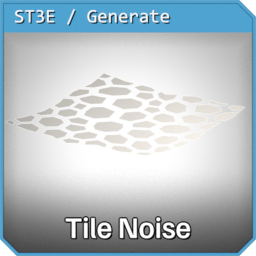 | **GN_TileableMeshNoise** | `GN_TileableMeshNoise.blend` | Seamlessly tileable cell mesh (tile = input bounds, or an explicit Bounds Size): noise-warped quad grid, Voronoi cell polygons, or the input mesh's own faces as cells; switchable distortion algorithms (Perlin value noise / Voronoi feature-pull / per-cell Swirl vortices); multi-pass sub-cell refinement with per-parent-cell probability; optional cell isolation with a gap (border verts slide along the tile edge so gaps stay open at seams and tiling stays continuous); per-cell `cell_id`/`cell_random` face attributes + `cell_color` debug color | Cell Type (Perlin Grid 4 / Voronoi ~6 / Input Mesh / Triangles 3 / Pentagons 5 / Octagons 8+4), Bounds Size (0 = auto from input bounds; per-axis override), Cells X/Y, Cell Subdivision, Distortion Type (Perlin / Voronoi / Swirl), Distortion, Seed, Passes, Pass Falloff, Pass Probability, Isolate Cells, Preserve Tile Border, Cell Gap |

### Mesh & Attribute Utilities
Edit materials, shading, or attribute data without changing the silhouette.

| Icon | Modifier | File | What it does | Key parameters |
|:---:|----------|------|--------------|----------------|
| 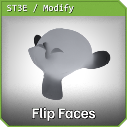 | **GN_FlipFaces** | `GN_FlipFaces.blend` | Flip face normals | Selection |
| 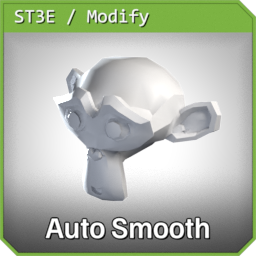 | **GN_AutoSmooth** | `GN_AutoSmooth.blend` | Shade smooth by angle | Angle, Selection (which faces get smoothed) |
| 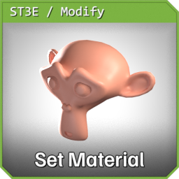 | **GN_SetMaterial** | `GN_SetMaterial.blend` | Assign a material to a selection | Material, Selection |
| 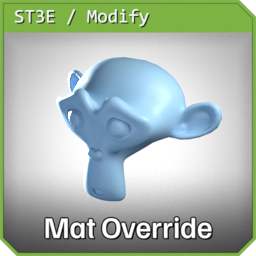 | **GN_MaterialOverride** | `GN_CollectionInstancer.blend` | Override all materials | On, Invert, Material Override |
| 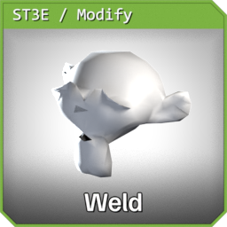 | **GN_Weld** | `GN_Weld.blend` | Merge by distance | Mode (All/Connected), Distance, Selection |
| 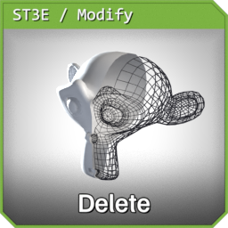 | **GN_Delete** | `GN_Delete.blend` | Delete geometry by selection/material/axis filters, plus an optional stray-geometry cleanup pass | Selection Mode, Material ID, Domain, Axis filters, Stray Geometry (loose verts/edges/faces/tris, small islands) |
| 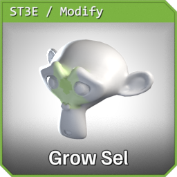 | **GN_GrowSelection** | `GN_GrowSelection.blend` | Grows a selection by a number of steps and outputs it as a boolean attribute; geometry passes through unchanged | Grow Iterations, Selection, Selection Domain (set it explicitly — the menu default is empty). Outputs: Selection, Diff Remainder |
| 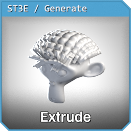 | **GN_ExtrudeFace** | `GN_ExtrudeSelection.blend` | Full-featured face extrusion (incl. region fill from marked edges) | Selection, Height, Divisions, Smooth, Crease, Material ID, … |
| 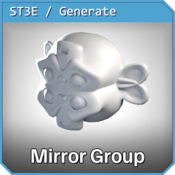 | **GN_MirrorGroup** | `GN_Mirror_Groupable.blend` | Per-axis mirror with UV & merge controls | X/Y/Z Axis, Mirror Object, Merge, UV controls |
| 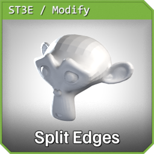 | **GN_SplitEdgeByAttribute** | `GN_SplitByAttribute.blend` | Split edges by an attribute / face-group boundary | Attribute Preset, Custom Attribute, Boundary of Face Group |
| 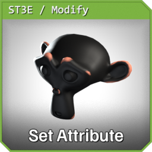 | **GN_SetAttribute** | `GN_AttributeFunctions_4.5.blend` | Build/write attributes from many selection criteria | Selection sources, Write-to Attribute, Mix Mode, … |
| 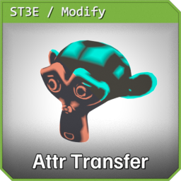 | **GN_AttributeTransfer** | `GN_AttributeFunctions_4.5.blend` | Transfer & remap attributes | From/To Attribute, Domain, Mix Mode, Blur |
|  | **GN_NormalTransfer** | `GN_NormalTransfer.blend` | Transfer custom normals from a source object, masked to keep originals where wanted | Source Object, Masking Mode (None / Attribute / Open Boundary Edges), Mask Attribute, Invert Mask |
|  | **GN_AmbientOcclusion** | `GN_AmbientOcclusion.blend` | Bake raycast ambient occlusion into a colour attribute (vertex colours), a float attribute, or both. A Repeat Zone fires `Samples` rays per vertex over the hemisphere — golden-angle azimuths rotated per vertex, so the noise is fine grain rather than banding — and the sampling core (`GNG_AmbientOcclusion`) is a standalone group other files LINK rather than reimplement; GN_VertexDataComposer's Ambient Occlusion source is this exact group | Selection, Samples, Distance, Spread, Cosine Weighted, Distance Falloff, Ray Bias, Jitter, Seed, Self Occlusion, Occluder Object/Collection, Auto Range, Input Min/Max, Invert, Gamma, Strength, Blur Iterations/Weight, Write To (Colour/Float/Both), Domain (Face Corner/Point), Colour Attribute, Float Attribute |
|  | **GN_VertexDataComposer** | `GN_VertexDataComposer.blend` | Author every channel an FBX mesh can carry — 4 colour attributes (RGBA) + 8 UV maps (U/V) = 32 independently writable channels, each with its own source and processing chain. Channels left off are untouched; unused slots are never created | Per channel: Write, Source (30 of them), Attribute, Component, Constant, Auto Range, From/To Min-Max, Clamp, Invert, Gamma, Quantize Steps, Blur, Encode sRGB. Per colour slot: Name, Domain (Vertex/Face Corner), Data Type (Byte/Float). Shared: Source Object, Seed, Compute Ambient Occlusion (+Samples, Distance, Spread — the linked `GNG_AmbientOcclusion` core), Compute Boundary Distance (+Boundary Edges), Compute Object Distance |

> Several deformers accept their `Selection` (and `GN_FlattenByBoundary` its `Boundary Edges`)
> as a **bindable attribute** via the modifier's *"sets via attribute"* toggle, so you can drive
> them from a stored edge/vertex group.

> **Every `Selection` has an `Invert Selection` toggle** right beneath it. Off, the modifier
> behaves exactly as before; on, it acts everywhere the selection is *not* set — so one bound
> vertex group works as either a mask or its complement.
>
> ⚠️ **Scenes saved before September 2026:** `GN_AutoSmooth`, `GN_Wireframe`, `GN_ConvexHull`,
> `GN_BoundingBox`, `GN_NoiseDisplace`, `GN_VoronoiDisplace`, `GN_Erosion`, `GN_Erosion_3D` and
> `GN_RandomDistribute` gained a `Selection` input then. Blender fills a new input on an
> *existing* modifier with `False`, so these read "nothing selected" and stop working — tick
> `Selection` once, or remove and re-add the modifier.

---

## 🖼 Asset Browser icons

Every ST3E asset has a preview icon: a framed Suzanne showing the modifier's effect, tinted by
catalog. The gallery below is the full set, including node-editor helper groups and shader
groups.

<!-- icon-gallery:start -->

*67 icons, generated by `_icons/gallery.py` from `_icons/out/manifest.json` — do not edit by hand.*

**ST3E/Deform** (18)

<table>
<tr><td align="center"> GN_Bend</td><td align="center"> GN_Cast</td><td align="center"> GN_Displace</td><td align="center"> GN_Erosion</td><td align="center"> GN_Erosion_3D</td><td align="center"> GN_FlattenByBoundary</td></tr>
<tr><td align="center"> GN_Inflate</td><td align="center"> GN_NoiseDisplace</td><td align="center"> GN_RandomizeMeshElements</td><td align="center"> GN_RandomizePosition</td><td align="center"> GN_ShearGeometry</td><td align="center"> GN_SimpleTransformMesh</td></tr>
<tr><td align="center"> GN_Smooth</td><td align="center"> GN_Stretch</td><td align="center"> GN_Taper</td><td align="center"> GN_Twist</td><td align="center"> GN_VoronoiDisplace</td><td align="center"> GN_Wave</td></tr>
</table>

**ST3E/Generate** (18)

<table>
<tr><td align="center"> GN_BoundingBox</td><td align="center"> GN_CellFrac</td><td align="center"> GN_ConvexHull</td><td align="center"> GN_DualMesh</td><td align="center"> GN_EdgeDestruct</td><td align="center"> GN_ExtrudeFace</td></tr>
<tr><td align="center"> GN_InsetFaces</td><td align="center"> GN_MeshBoolean</td><td align="center"> GN_MirrorGroup</td><td align="center"> GN_Mosaic</td><td align="center"> GN_QuadCap</td><td align="center"> GN_RadialArray</td></tr>
<tr><td align="center"> GN_Solidify2</td><td align="center"> GN_Subdivide</td><td align="center"> GN_TileableMeshNoise</td><td align="center"> GN_Triangulate</td><td align="center"> GN_VoxelRemesh</td><td align="center"> GN_Wireframe</td></tr>
</table>

**ST3E/Modify** (13)

<table>
<tr><td align="center"> GN_AmbientOcclusion</td><td align="center"> GN_AttributeTransfer</td><td align="center"> GN_AutoSmooth</td><td align="center"> GN_Delete</td><td align="center"> GN_FlipFaces</td><td align="center"> GN_GrowSelection</td></tr>
<tr><td align="center"> GN_MaterialOverride</td><td align="center"> GN_NormalTransfer</td><td align="center"> GN_SetAttribute</td><td align="center"> GN_SetMaterial</td><td align="center"> GN_SplitEdgeByAttribute</td><td align="center"> GN_VertexDataComposer</td></tr>
<tr><td align="center"> GN_Weld</td></tr>
</table>

**ST3E/Scatter & Instancing** (4)

<table>
<tr><td align="center"> GN_CollectionInstancerModel</td><td align="center"> GN_PointsToSpheres</td><td align="center"> GN_RandomDistribute</td><td align="center"> GN_Scatter</td></tr>
</table>

**ST3E/Group — node-editor helpers, not modifiers** (12)

<table>
<tr><td align="center"> GN_ExpandContractSelection</td><td align="center"> GN_Smooth Position</td><td align="center"> GNG_AmbientOcclusion</td><td align="center"> GNG_Mirror</td><td align="center"> GNG_MixAlpha</td><td align="center"> GNG_MixRGBXYZValues</td></tr>
<tr><td align="center"> GNG_SetAttributename</td><td align="center"> GNG_StoreAttributeOnDomain</td><td align="center"> GNG_TileableNoiseCoords</td><td align="center"> GNG_VertexChannel</td><td align="center"> SHG_TileableNoiseUV</td><td align="center"> SHG_TwistedTorusUV</td></tr>
</table>

**ST3E/Shading — shader groups in `Blender/Shading/`** (2)

<table>
<tr><td align="center"> SH_Cavity</td><td align="center"> SH_ScreenCavity</td></tr>
</table>

<!-- icon-gallery:end -->

---

## 🛠 Also in this folder

- **Node-group utilities** (Asset Browser only, not modifiers): `GN_FillBorder`,
  `GN_MeshFromImage`, `GN_DisplaceByImage`, and the helper groups on the `ST3E/Group` catalog
  shown in the gallery above.
- **Procedural Tree Generator** — see [`TreeGenDocu/`](TreeGenDocu/README.md).

Building or changing a modifier? See [AUTHORING.md](AUTHORING.md).
