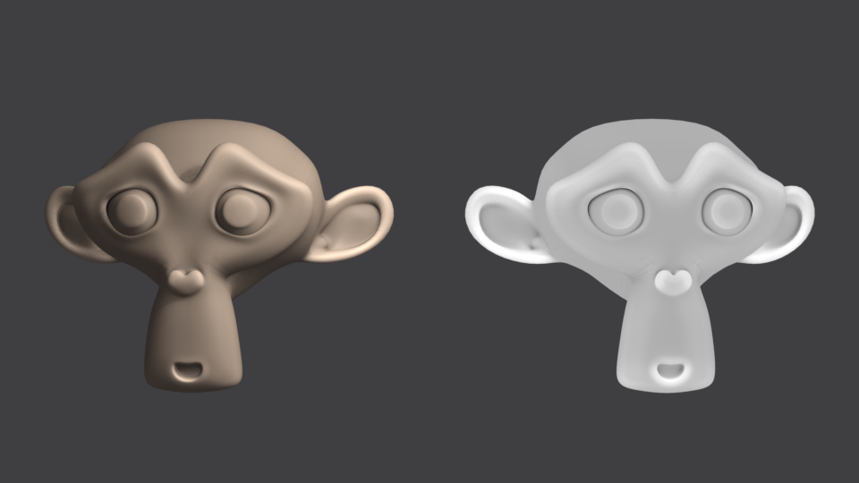
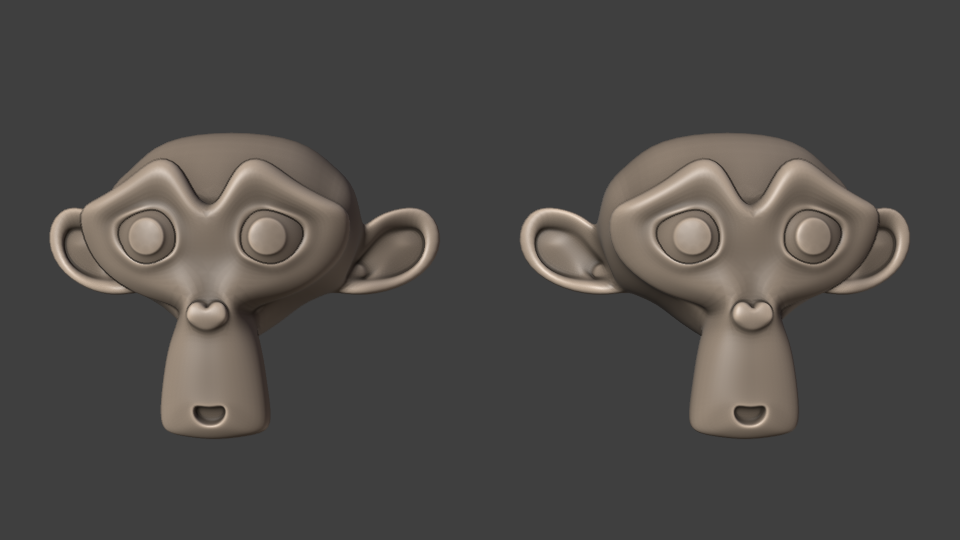
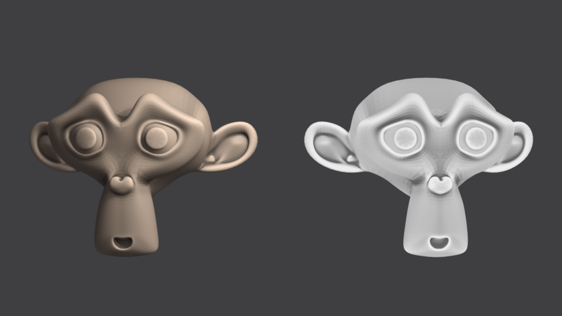

# Shading

Blender material shader networks — ports from other engines, and shader node
groups that reproduce viewport-only features inside a render engine.

---

## SH_Cavity.blend

A shader node group that reproduces Blender's **Solid-viewport Cavity overlay**
inside **EEVEE** and **Material Preview**.

| | |
|---|---|
| Node group | `SH_Cavity` (7 inputs in 2 panels, 4 outputs) |
| Materials | `M_SH_Cavity_Demo` (Principled), `M_SH_Cavity_Demo_Flat` (Emission — the literal overlay) |
| Objects | `SH_Cavity_Demo`, `SH_Cavity_Demo_Flat` |
| Asset | catalog `ST3E/Shading`, tag `ST3E` |
| Engine | EEVEE (works in Cycles too) |
| Built with | Blender 5.0 |



*Above: `SH_Cavity` in EEVEE. Below: the same two heads rendered by Workbench
with its own Cavity overlay at the same Ridge/Valley values, for comparison.*



### Using it

Append `SH_Cavity` (File ▸ Append ▸ NodeTree), or drag it out of the Asset
Browser under **ST3E/Shading**. Then either:

- **Tint an existing material** — plug `Color` into Principled ▸ Base Color,
  with the group's `Base Color` set to the albedo you wanted.
- **Get the raw overlay** — use the `Factor` output (1.0 = untouched, below 1 a
  valley, above 1 a ridge) and multiply it into whatever you like.
- **Reproduce the viewport look exactly** — `Color` into an **Emission**, as in
  `M_SH_Cavity_Demo_Flat`.

`Concave` and `Convex` are also exposed as plain 0–1 masks — useful as dirt and
edge-wear masks independently of the cavity look.

### What it reproduces, exactly

Workbench composites the overlay in one line
(`workbench_composite.bsl.hh`):

```glsl
color.rgb *= clamp((1 - cavity) * (1 + edges) * (1 + curvature), 0, 4);
```

`cavity`/`edges` are the "World" type (an Alchemy SSAO over the depth buffer,
scaled by the Valley and Ridge factors); `curvature` is the "Screen Space" type
(the screen-space derivative of the normal buffer, split by sign and
soft-clamped):

```glsl
curvature_soft_clamp(c, ctrl) = c < 0.5/ctrl ? c * (1 - c*ctrl) : 0.25/ctrl
curvature = normal_diff < 0 ? -2 * soft_clamp(-normal_diff, valley_ctrl)
                            :  2 * soft_clamp( normal_diff, ridge_ctrl)
ridge_ctrl = 0.5 / max(ridge², 1e-4)    valley_ctrl = 0.7 / max(valley², 1e-4)
```

**All of that maths is reproduced node for node**, including the 0.5/0.7
asymmetry and the 0–4 output clamp. So the Ridge and Valley sliders respond the
way the viewport's do: 0 disables a term, and the soft clamp ceilings a ridge at
+1.0 and a valley at −0.714 with the sliders at 1.0.

### What it cannot reproduce, and what replaces it

Shader nodes cannot sample the depth or normal buffer, and there is no
derivative node — so the two *sources* feeding that maths had to be replaced.
Both become an **Ambient Occlusion probe pair**: outward (`inside` off) reads
concavity, inward (`inside` on) reads convexity, and `normal_diff` becomes
`convex − concave`. The World section runs that pair at `World Distance`, the
Screen section at the much smaller `Screen Distance`.

Consequences worth knowing:

- **Radius, not pixels.** The viewport's Screen Space curvature is one pixel
  wide, so it changes as you zoom. `Screen Distance` is a world-space radius, so
  it does not — it is stable under camera motion, but you must scale it with
  your model (default 0.05 suits a ~2 m object).
- **Valley reads weaker than Ridge.** The inward probe hits geometry more
  readily than the outward one, so `convex − concave` is biased toward ridge.
  Push `Screen Valley` / `World Valley` above 1.0, or widen the distance, to
  balance them. The sliders go to 2.5 for this reason.
- **Cost.** Four AO evaluations per pixel. If you only need one scale, delete
  the probe pair you are not using and wire that section's inputs to 0 — a
  slider at 0 removes the *effect* but not the trace.
- Object-space by nature, so unlike the viewport overlay it does not swim, and
  it also works in Cycles.

Geometry ▸ **Pointiness** was checked as a curvature source first and rejected:
it is Cycles-only and returns a flat 0.5 in EEVEE. The other route — a
screen-space derivative smuggled out of the **Bump** node's internals — needs no
ray tracing at all and ships separately as **`SH_ScreenCavity`** below.

### Rebuilding

```
blender.exe --background --factory-startup --python _build/build_sh_cavity.py
blender.exe --background --factory-startup SH_Cavity.blend --python _build/tidy_shader_group.py
blender.exe --background --factory-startup SH_Cavity.blend --python _build/verify_sh_cavity.py
```

`tidy_shader_group.py` runs the deterministic layout engine from
`Addons/ClaudeVibe_WIPs/LLMGeonodePipeline/` (it keys only on generic node
idnames, so it works on a shader tree) and gates the save on audit rules
R1–R11. `verify_sh_cavity.py` runs 17 checks — interface contract, the identity
case, per-slider direction, both soft-clamp ceilings, the 0–4 clamp, distance
response, mask ranges — and writes the two comparison renders above.

> Numeric probes there render with `filter_size = 0.01`. At the default 1.5 px
> reconstruction filter, EEVEE mixes the transparent background into pixels that
> still report alpha 1.0, so even a constant emission of 1.0 reads back as 0.985
> near the silhouette and every tolerance test picks up a phantom 1.5 % error.

---

## SH_ScreenCavity.blend

The same overlay's **Screen Space** half, computed the way the viewport actually
computes it — from the screen-space derivative of the view normal — with **no
Ambient Occlusion node and no ray tracing at all**.

| | |
|---|---|
| Node group | `SH_ScreenCavity` (5 inputs in 1 panel, 4 outputs) |
| Materials | `M_SH_ScreenCavity_Demo` (Principled), `M_SH_ScreenCavity_Demo_Flat` (Emission — the literal overlay) |
| Objects | `SH_ScreenCavity_Demo`, `SH_ScreenCavity_Demo_Flat` |
| Asset | catalog `ST3E/Shading`, tag `ST3E` |
| Engine | EEVEE (works in Cycles too) |
| Built with | Blender 5.0 |



*Above: `SH_ScreenCavity` at its defaults. Below: Workbench rendering the same
heads with its own Cavity ▸ Screen Space overlay.*


### The algorithm

`workbench_curvature_lib.glsl` samples the normal buffer one pixel up, down,
left and right and sums two differences:

```glsl
normal_diff = (normal_up - normal_down) + (normal_right - normal_left);
```

`normal_up`/`normal_down` are the view normal's **.y**, `normal_right`/`.left`
its **.x** — so `normal_diff` is the **screen-space divergence of the view-space
normal**. It is then split by sign and soft-clamped, exactly as in `SH_Cavity`,
and composited as `color *= clamp(1 + curvature, 0, 4)`.

### Getting a derivative without a derivative node

Shader nodes have no `dFdx`. **Bump is the only node that exposes one**: its
GLSL builds `surfgrad = dHdx*Rx + dHdy*Ry` from the screen derivatives of its
Height input. Feeding it the view normal's components and differencing the two
bump directions recovers that derivative:

```
dot( Bump(h, invert off) - Bump(h, invert on), axis )  ~  -2*D * dH(axis) / det
```

Four Bump nodes — two per screen axis — give the two terms of `normal_diff`
directly. Everything downstream is Blender's own maths, node for node.

Measured, not assumed (`verify_sh_screencavity.py`, 21 checks):

- a **flat plane returns exactly 1.0**, and `Normal Diff` exactly 0
- a **convex sphere returns a ridge**, uniformly
- the soft clamp ceilings land on **2.0000** and **0.2856**, as the formula demands
- **Pearson r = 0.73 against Workbench's own Screen Space cavity** on the same
  geometry, at the same Ridge/Valley — Workbench with Lighting=Flat and a white
  single colour outputs precisely this group's `Factor`, so the two are directly
  comparable pixel for pixel
- the default `Curvature Scale` of 2.0 was **calibrated** against that reference:
  it reproduces the viewport's output level (mean factor **1.1903 vs 1.1901**) at
  the lowest RMSE across a sweep

### Where it differs from the viewport

- **Amplitude is world-normalised, not pixel-scaled.** Bump divides `surfgrad`
  by `det`, which cancels the pixel footprint — verified invariant to zoom,
  camera distance and resolution. The *sampling footprint is still one pixel*
  (`dFdx`), so the effect stays as crisp as the viewport's; only its strength
  stops depending on the camera. That is why `Curvature Scale` exists at all:
  the viewport gets its amplitude from the pixel size, this gets it from you.
  Set `Distance Scaling` to 1.0 to put the viewport's distance dependence back.
- **Bump saturates if pushed through `Distance`.** The probe step is therefore
  fixed at 0.01 internally and `Curvature Scale` multiplies afterwards, which
  keeps the control exactly linear (verified: 2.0 → 4.0 gives a 2.008× ratio).
- **Faceting on coarse meshes.** Differentiating a piecewise-linear normal field
  gives piecewise-*constant* curvature, so low-poly or lightly subdivided
  surfaces show the topology. Subdivide, or lower `Curvature Scale`.
- **No silhouette rejection.** The viewport compares object IDs at the four taps
  and bails on outlines; `dFdx` stays within one primitive's quad, so the case
  mostly does not arise, but a 2×2 quad straddling a silhouette can still flare.
- Bump flips its `dist` on backfaces, so the sign is corrected with
  Geometry ▸ Backfacing — verified that flipping a mesh's normals leaves the
  reading identical.

### Which one to use

| | `SH_Cavity` | `SH_ScreenCavity` |
|---|---|---|
| Source | Ambient Occlusion probes | Bump screen derivative |
| Cost | 4 AO traces/pixel | 4 Bump nodes, no tracing |
| Covers | World **and** Screen Space | Screen Space only |
| Reads | broad occlusion + edges | crisp creases and edges |
| Weakness | ray-trace cost, ridge-biased | faceting on coarse meshes |

They compose: multiply the two `Factor` outputs for the viewport's "Both".

### Rebuilding

```
blender.exe --background --factory-startup --python _build/build_sh_screencavity.py
blender.exe --background --factory-startup SH_ScreenCavity.blend --python _build/tidy_shader_group.py
blender.exe --background --factory-startup SH_ScreenCavity.blend --python _build/verify_sh_screencavity.py
```

---

## ash_char_base_SSS.blend

Blender re-creation of the Unity URP shader
`ash_char_base_SSS` (Amplify Shader Editor 1.9.9.4), from
`Project Main/unity/Assets/ProjectAres/Assets/Shader/ash_char_base_SSS.shader`.

| | |
|---|---|
| Node group | `ASH_CharBase_SSS` (38 inputs, grouped into 7 panels) |
| Material | `M_ash_char_base_SSS` |
| Object | `Sphere_ash_char_base_SSS` (64×32 UV sphere, smooth shaded) |
| Engine | EEVEE |
| Built with | Blender 5.0 |

### What the Unity shader actually is

Despite the PBR-sounding property names it is **not** a lit shader.
`UniversalMaterialType = "Unlit"`, the forward pass compiles as
`SHADERPASS_UNLIT`, and the final colour is written straight to the target —
metallic, smoothness and "specular" are all just inputs to hand-rolled
stylised maths. It is a character shader that fakes rim light, a matcap-style
highlight and back-lit translucency, then composites them with two
**colour-dodge** blends.

Only the `Forward` pass carries colour logic; `GBuffer` duplicates it and the
remaining passes (`ShadowCaster`, `DepthOnly`, `DepthNormals`, `MotionVectors`,
`SceneSelection`, `ScenePicking`, `Meta`) only reuse `Alpha`.

### Feature map (Unity → Blender)

Frame names in the node group match the Unity intermediates (`Fresnel51`,
`ReflectionDot264`, …) so the two can be read side by side.

| Unity | Blender |
|---|---|
| `smoothstep(e0, e1, x)` | **Map Range**, interpolation `Smoothstep` |
| `saturate()` | **Clamp** node / `use_clamp` on Math |
| Colour Dodge `dest / max(1-src, 1e-5)` | **Mix Color**, blend `Dodge`, Factor 1, Clamp Result — identical formula |
| `_MaskTexture` R/A | Separate Color → `Metallic114 = mask.r * _Metallic`, `Smoothness115 = _Smoothness * mask.a` |
| `dot(N, V)` fresnel | Geometry **Normal** · **Incoming** (`Incoming` = surface→camera = `ViewDirWS`) |
| `saturate(dot(NormalWS, (0,1,0)))` | dot with `(0,0,1)` — Unity is Y-up, Blender Z-up |
| `dot(positionOS, _FresnelMaskDirection)` | **Vector Transform** World→Object (Point) → Dot → Map Range |
| `saturate(sign(dot(normalOS, viewDirOS)))` | `1 - ` Geometry **Backfacing** (exact, and cheaper) |
| `mul(UNITY_MATRIX_IT_MV, normal)` | **Vector Transform** World→Camera (Normal) **× (1,1,-1)** — see note below |
| Parallax `viewDirTS` | Tangent + `cross(N,T)` bitangent + 3 dot products, in the material tree (it has to drive an Image Texture's Vector) |
| `_ALPHATEST_ON`, clip 0.5 | Math `Greater Than` 0.5 → **Mix Shader** between Transparent BSDF and Emission |
| `Cull Off` | `use_backface_culling = False` |
| Unlit output | **Emission** shader (strength 1.0) |

**View-space Z flip.** Blender's Vector Transform `Camera` space puts +Z *into*
the screen; Unity's view matrix follows the GL convention (camera looks down
−Z, so a normal facing the viewer has z = +1). This was verified by rendering
the transformed normal and reading pixels, not assumed. Without the flip any
`Specular Vector` with a Z component points the wrong way.

### The pipeline

```
BaseColorTex × BaseColorTint × lerp(InsideFaceTint, white, FrontFace·AlphaMap)
        ─── COLOR DODGE ◄── Fresnel51 · FrontFaceMask · AlphaMap
                │
                ├── + Secondary_Lights186
                └── + Translucency110
                        │
                ─── COLOR DODGE ◄── ReflectionDot264 · Smoothness · SpecAmount · MetallicTint
                        │
                     Emission ── Mix Shader ── Material Output
                                     ▲
                          Greater Than(Alpha, 0.5)
```

- **Fresnel51** — `pow(1-NdotV, Power)·Scale + Bias`, masked by a world-up
  dot and an object-space gradient, then pushed through two smoothsteps
  (`Edge1 × Amount + Edge2`) and saturated. Two-band = a soft inner falloff
  plus a hard outer lip.
- **ReflectionDot264** — matcap-style. `dot(viewSpaceNormal, normalize(_SpecularVector + (smoothness·offset, 0, 0)))`,
  raised to `_SpecularPower`, then the same two-band smoothstep. With the Unity
  default `_SpecularVector = (1,0,0)` the highlight sits on the right-hand
  silhouette.
- **Translucency110** — the "SSS". `TranslucencyColor × TranslucencyTex ×
  pow(1-NdotV, _TranslucencyPower) × ViewToMainLightMask`, where the mask is
  `lerp(AmountBase, Amount, pow(saturate(dot(lightDir, -viewDir)), DirLightPower))`
  — i.e. it peaks when the main light is **behind** the subject.

### Two things Blender cannot do natively

1. **`Main Light Direction`** replaces URP's `_MainLightPosition.xyz`. Shader
   nodes cannot query a light, so this is a manual vector: the world-space
   direction *towards* the sun. The `MainLight` sun object in the scene is
   oriented to match the default `(0.30, 0.75, 0.59)`; if you move the sun,
   update this input too (or drive it with a driver off the sun's rotation).
2. **`Secondary Lights Color`** replaces the URP additional-lights loop
   (`AdditionalLightsLambertMask10x` / `AdditionalLightsFlatMask10x`), which
   iterates every point/spot light per fragment. Blender has no equivalent, so
   it is a manual colour, defaulting to black. The Unity logic around it —
   `smoothstep(0.5, 0.6, luminance(...)) × lightColor × BaseColorTex` — is
   reproduced faithfully, so feeding a colour in behaves the same way.

`VColor Occlusion` is exposed for parity but the Unity source hardcodes it to
`1.0` (`VColorOcclusion112 = 1.0 * 1.0`).

### Textures

The five image slots hold flat 8×8 placeholders matching Unity's declared
fallbacks — `_BaseColorTexture` gray, `_MaskTexture` white, `_height` white,
`_Alpha` white. The one deviation is `_TranslucencyTexture`: Unity falls back
to **black** (SSS off), so a warm value is used instead to make the
translucency term visible on the demo sphere. Swap all five for the real maps.

Per-texture `_ST` tiling/offset is a single shared **Mapping** node; split it
if the Unity material uses different tiling per texture.

`_Alpha` is sampled twice, as in the original: once at the parallax-offset UV
(feeds the tint/rim masks) and once at the plain UV (drives the alpha clip).
