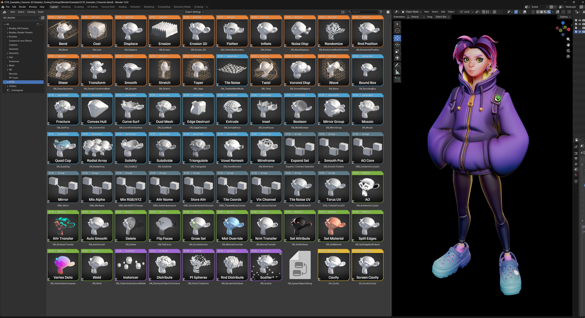

# ST3E — Stephko's 3D Extensions

> Production-ready tools for Blender, Unity, and 3DS Max workflows

Free Blender addons, a 53-modifier Geometry Nodes library, shader ports, and a legacy 3ds Max
toolkit — built for and tested in real production.
**Every tool below links straight to its docs and its installable zip.**

**Why "ST3E"?** It is the name for the whole toolset, not just one part of it. Three letters
you can type with one hand, so it is quick to call up and search for — and wherever it
appears (the *Add Modifier → ST3E* menu, the `ST3E` asset tag, these docs) it leads you to the
rest of the tools.

---

## 🔷 Blender Addons

| Tool | What it does | Get it |
|------|--------------|--------|
| **Mass Collection Exporter** | Batch export collections/objects (FBX, OBJ, DAE, glTF) with suffix grouping and per-collection settings | [docs](Blender/Addons/MassExporter/README.md) · [tutorial](Blender/Addons/MassExporter/TUTORIAL.md) · [zip](Blender/Addons/MassExporter/distribution/) |
| **Quick Animation Export** | One-click export of animation/action clips, game-engine ready | [docs](Blender/Addons/QuickAnimationExport/README.md) · [zip](Blender/Addons/QuickAnimationExport/distribution/) |
| **Library Relink** | Bulk-relink a file's linked libraries to a new folder, with a dry-run preview | [docs](Blender/Addons/LibraryRelink/README.md) · [zip](Blender/Addons/LibraryRelink/distribution/) |
| **Library Publisher** | Publish the ST3E asset library to a Google Shared Drive | [docs](Blender/Addons/LibraryPublisher/README.md) · [zip](Blender/Addons/LibraryPublisher/distribution/) |
| **Smart Crease** | Context-sensitive edge/vertex crease with preset keys and modal mouse control | [docs](Blender/Addons/Smart%20Crease/README.md) · [zip](Blender/Addons/Smart%20Crease/distribution/) |
| **Smart Collapse** | 3ds Max-style collapse — merge at center | [docs](Blender/Addons/Smart%20Collapse/README.md) · [zip](Blender/Addons/Smart%20Collapse/distribution/) |
| **Smart Set Orientation** | Transform orientation from selection, Maya working-pivot style | [docs](Blender/Addons/Smart%20Set%20Orientation/README.md) · [zip](Blender/Addons/Smart%20Set%20Orientation/distribution/) |
| **Center Edges / Loops** | Center edge loops or selections along their average position | [docs](Blender/Addons/Center%20Edges/README.md) · [zip](Blender/Addons/Center%20Edges/distribution/) |
| **Edge Constraint Mode** | 3ds Max-style edge constraint — verts slide along topology while transforming | [docs](Blender/Addons/EdgeConstraintMode/README.md) · [zip](Blender/Addons/EdgeConstraintMode/distribution/) |
| **Synced Modifiers** | Keep modifiers in sync across objects, including Geometry Nodes inputs | [docs](Blender/Addons/SyncedModifiers/README.md) · [zip](Blender/Addons/SyncedModifiers/distribution/) |
| **Modifier List (Stephko fork)** | Enhanced modifier-stack UI: list view, popup, sidebar | [docs](Blender/Addons/ModifierList_Stephko/README.md) · [zip](Blender/Addons/ModifierList_Stephko/distribution/) |
| **Toggle Modifier Display** | Toggle modifier visibility in edit mode (D / Shift+D), 3ds Max "show end result" style | [docs](Blender/Addons/Toggle%20Modifier%20Display/README.md) · [zip](Blender/Addons/Toggle%20Modifier%20Display/distribution/) |
| **Tile UV Projector** | Tile-based UV projection and placement for texture atlases | [docs](Blender/Addons/TileUVProjector/README.md) · [zip](Blender/Addons/TileUVProjector/distribution/) |
| **Add Bounds To Name** | Rename objects from their bounding-box dimensions | [docs](Blender/Addons/AddBoundsToName/README.md) · [zip](Blender/Addons/AddBoundsToName/distribution/) |
| **Skin Transfer Setup** | Per-part skinning: as-is, data transfer, or bind-to-bone | [docs](Blender/Addons/SkinTransferSetup/README.md) · [zip](Blender/Addons/SkinTransferSetup/distribution/) |
| **Compositor Render Sets** | Manage multiple render setups in the compositor, with batch rendering | [docs](Blender/Addons/Compositor%20Render%20Sets/README.md) · [zip](Blender/Addons/Compositor%20Render%20Sets/distribution/) |
| **Edit Mode Overlay** | Extra edit-mode viewport feedback and text overlay | [docs](Blender/Addons/Edit%20Mode%20Overlay/README.md) · [zip](Blender/Addons/Edit%20Mode%20Overlay/distribution/) |

**Install:** drag the zip from the tool's `distribution/` folder onto Blender, or
*Edit → Preferences → Add-ons → Install from Disk…*, then enable it.

---

## 🧱 Geometry Nodes library

**53 modifiers** straight from **Add Modifier → ST3E**: deformers, generators, topology and
attribute tools. Every one has an Asset Browser icon and ships with a demo object.

→ **[Library reference](Blender/Geonodes/README.md)** —
[Deformers](Blender/Geonodes/README.md#deformers) ·
[Generators & Topology](Blender/Geonodes/README.md#generators--topology) ·
[Mesh & Attribute Utilities](Blender/Geonodes/README.md#mesh--attribute-utilities) ·
[Procedural Tree Generator](Blender/Geonodes/TreeGenDocu/README.md)

**Install:** *Preferences → File Paths → Asset Libraries* → add the **`Blender/`** folder
(not `Blender/Geonodes/`), set Import Method to **Link**, then use *Add Modifier → ST3E*.

---

## 🎨 More

- **[Shading](Blender/Shading/README.md)** — Blender re-creations of Unity URP shaders, plus cavity and curvature effects
- **[Unity — Model Import Processor](Unity/ModelImportProcessor/README.md)** — automated FBX/model import pipeline (Unity 2019.4+)
- **[3ds Max](3DSMAX/README.md)** — the original ST3E MaxScript tools and custom modifiers. ⚠️ Maintenance only since 2023.

---

## 📚 Help

- 📖 **[Documentation Index](DOCUMENTATION_INDEX.md)** — every tool with its version
- 📝 [Quick Reference](QUICK_REFERENCE.md) — shortcuts and panels at a glance
- 🔧 [Installation details](DOCUMENTATION_INDEX.md#-installation-guides) · 🐛 [Troubleshooting](DOCUMENTATION_INDEX.md#-troubleshooting)
- 🛠 Building or changing these tools? See **[DEVELOPMENT.md](DEVELOPMENT.md)**

**Requirements:** Blender 5.0 recommended, 4.5+ supported. No external Python dependencies.

---

## 📜 License

Free for personal and commercial use — use, modify, and share. Attribution appreciated,
not required. No warranty.

## 📞 Contact

**Stephan Viranyi (Stephko)** — stephko@viranyi.de ·
[ArtStation](https://www.artstation.com/stephko) ·
[LinkedIn](https://www.linkedin.com/in/stephanviranyi/)

Bug reports and ideas welcome by email. Not accepting pull requests, but fork freely.
Developed with Claude (Anthropic) as a coding assistant.
